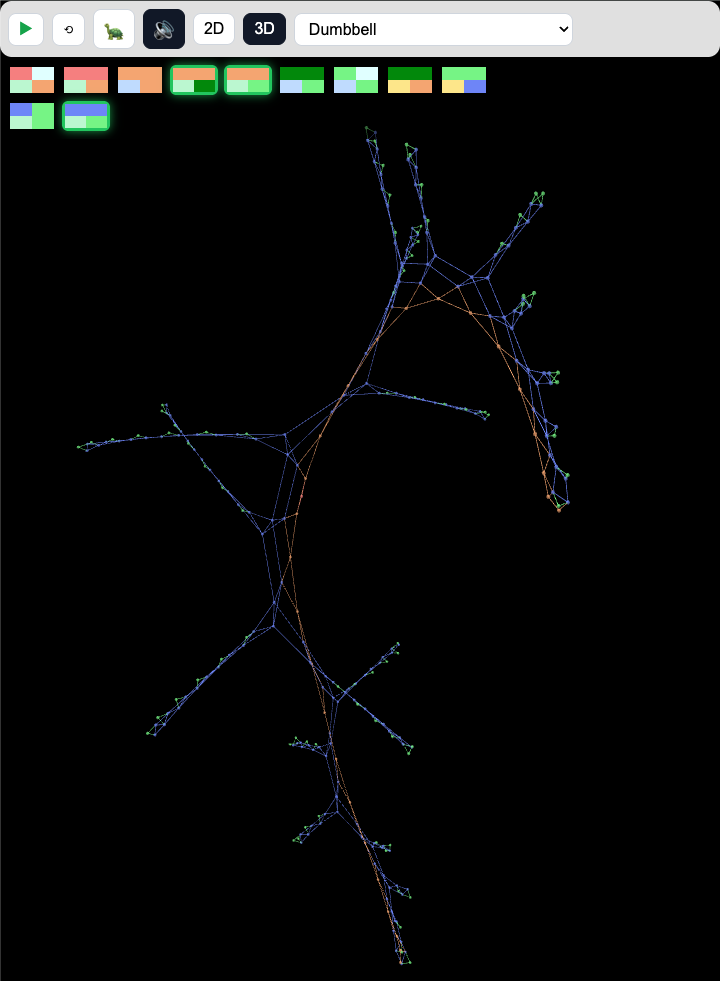

# Graph Unfolding Cellular Automata (GUCA) Interactive Demonstration Project
  
[GUCA Interactive Demonstration](https://roma-goodok.github.io/guca)

## Video intro (6 min)

## Create your own organism

See: [docs/GENOME_GUIDE.md](docs/GENOME_GUIDE.md)

## Main Idea

The web visualization of graph unfolding cellular automata (GUCA) showcases a "gene" of the graph, which is a program of primitive operations (add node, connect nodes, change node status by conditions), created manually or as a result of a genetic algorithm. Users can manipulate the graph by adding, removing vertices and edges, and observe the unfolding process in real-time, providing a unique and engaging way to explore and analyze cellular automata. This project demonstrates genetic programming over graphs and artificial life, particularly morphogenesis.

  

  
## Requirements  
  
1. Animated visualization of graph unfolding cellular automata based on a genetic algorithm.  
2. Interactive graph visualization with real-time updates.  
3. Support for adding, removing, and updating vertices and edges.  
4. Implementation of a force-directed layout algorithm, extendable to 3D.  
5. A virtual "knife" mouse tool for cutting edges interactively.  
6. Smooth and responsive user experience.  
  
## Selected Frameworks  
  
- **Frontend**: JavaScript/TypeScript with Three.js  
  - Motivation: Three.js is a powerful 3D visualization library that leverages WebGL for creating advanced graphics. It is suitable for implementing a custom force-directed algorithm and provides the necessary tools for creating interactive 3D graph visualizations.  

## Links

###  "Living Graphs" — Growing Graph Unfolding Cellular Automata (GUCA) with Examples in Silverlight (2010)
Article (RUS): [https://habr.com/en/articles/107387](https://habr.com/en/articles/107387)  

The concept of 'Living Graphs' utilizes cellular automata to model the self-assembly and evolution of graph structures.   

"Living Graphs" leverage the principles of cellular automata to simulate the evolution and self-organization of graph structures, contributing to the field of Artificial Life. The GUCA model operates by applying simple, context-specific rules to nodes within a graph. This method facilitates the emergence of complex structures from minimal initial conditions, mirroring biological growth and development. The article showcases several examples, illustrating the potential of GUCA in diverse fields such as robotics, computer networks, and artificial intelligence, while highlighting the model's modularity, regeneration, and adaptability.

###  Computational Life: How Well-formed, Self-replicating Programs Emerge from Simple Interaction  
Blaise Agüera Arcas† Jyrki Alakuijala James Evans Ben Laurie Alexander Mordvintsev Eyvind Niklasson† Ettore Randazzo† Luca Versari  

Paper: [https://arxiv.org/pdf/2406.19108v2](https://arxiv.org/pdf/2406.19108v2)  
Code: [https://github.com/paradigms-of-intelligence/cubff](https://github.com/paradigms-of-intelligence/cubff)  

## Automating the Search for Artificial Life with Foundation Models  

Paper: [https://arxiv.org/pdf/2412.17799v1](https://arxiv.org/pdf/2412.17799v1)  
Code: [https://github.com/sakanaai/asal](https://github.com/sakanaai/asal)  

The paper introduces ASAL (Automated Search for Artificial Life), an automated search method using foundation models to discover and analyze artificial life simulations.
