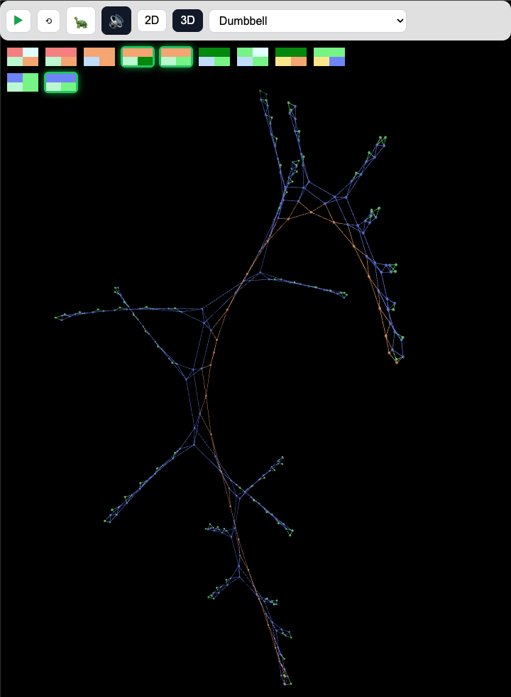

# GUCA Interactive Visualization

[Live demo](https://roma-goodok.github.io/guca)

GUCA (Graph Unfolding Cellular Automata) is a browser-based simulator for graph cellular automata genomes. A genome is an ordered rule table that mutates an undirected graph over time: nodes can change state, create children, connect to nearby nodes, disconnect, or die.

The app is built with TypeScript, Webpack, Jest, D3, `graphlib`, and `3d-force-graph`.

<p align="center">
  
</p>

## Use The App

- Built-in genome YAML files live in `data/genoms/`.
- The genome format is documented in [docs/GENOME_GUIDE.md](docs/GENOME_GUIDE.md).
- The UI can load built-in genomes, upload YAML/JSON genomes, edit rules, export the current genome, and share genomes through URL hashes.

## Local Development

```bash
npm ci
npm run start
```

Open `http://127.0.0.1:8080`.

Common checks:

```bash
npm run typecheck
npm test
npm run check
npm run build
```

`npm run check` runs TypeScript type checking and Jest. `npm run build` writes the browser bundle to `dist/bundle.js`.

## Architecture Map

- `src/gum.ts`: core Graph Unfolding Machine, graph model, rule execution, topology semantics, cleanup behavior.
- `src/genomeLoader.ts`: YAML/JSON genome parsing and defaults.
- `src/main.ts`: browser entry point, DOM wiring, 2D D3 view, simulation loop, genome import/export.
- `src/graph3d.ts`, `src/graphData.ts`: 3D graph rendering and data adaptation.
- `src/ruleEditor.ts`, `src/nodeInspector.ts`: interactive rule and node inspection tools.
- `src/utils.ts`, `src/edgeGradients.ts`, `src/viewport.ts`, `src/responsive.ts`: shared UI and rendering helpers.
- `src/__tests__/`: Jest regression tests for core behavior, loaders, rendering helpers, sharing, and UI-adjacent pure helpers.

## Artifact Policy

`dist/bundle.js` is currently tracked as the static browser artifact used by the hosted demo flow. Do not rebuild and commit `dist/bundle.js` as incidental cleanup; update it only when intentionally publishing a frontend change.

## Agent Notes

Project-specific AI-agent guidance lives in [AGENTS.md](AGENTS.md). The old prompt-bundling workflow has been removed; agents should inspect the repo directly and use the documented runbook.

## Background

- Original "Living Graphs" article: [habr.com/en/articles/107387](https://habr.com/en/articles/107387)
- Related artificial life work: [Computational Life](https://arxiv.org/pdf/2406.19108v2), [ASAL](https://arxiv.org/pdf/2412.17799v1)
